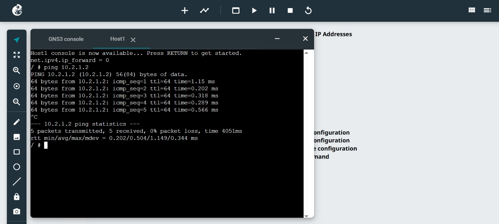
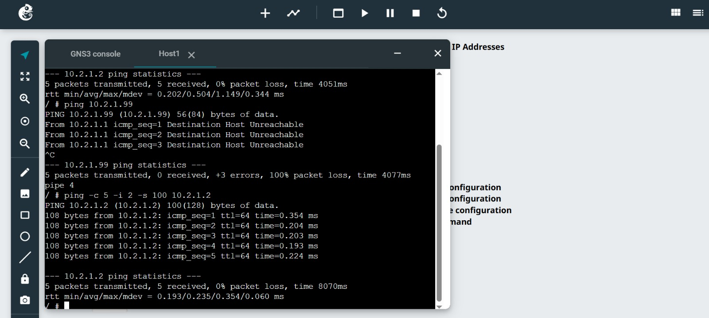

# Week 02 – Task 2: Testing Network Connectivity with Ping

## Student information

- **Student:** Ahmed Uddin Syed
- **Student ID:** 12325506
- **Unit code:** COIT20261
- **Tutor:** Mr Hossain
- **Campus:** Sydney
- **Date completed:** 29 August 2026

## Aim

The aim of this activity is to use the `ping` command to test whether
another device is reachable and examine round-trip time, packet loss,
packet count, transmission interval and packet size.

## Network information

This activity uses the `Setting-IP-12325506` project from Task 1.

| Device | IPv4 address |
|---|---|
| Host1 | 10.2.1.1/24 |
| Host2 | 10.2.1.2/24 |
| Host3 | 10.2.1.3/24 |
| Host4 | 10.2.1.4/24 |

## Test 1: Basic ping

The following command was run from Host1 to Host2:

```bash
ping 10.2.1.2
```

The command was stopped with `Ctrl+C` after at least five replies.



### Observation

The replies demonstrate that Host2 is reachable from Host1. The summary
shows the number of packets transmitted and received, packet loss and
round-trip-time statistics.

## Test 2: Ping to an unused address

The following command was used to test an address that was not assigned
to any host:

```bash
ping 10.2.1.99
```

The test was allowed to run for at least ten seconds and was then stopped
with `Ctrl+C`.


### Observation

No device was configured with `10.2.1.99`, so no ICMP echo replies were
received. The summary shows 100% packet loss.

## Test 3: Ping with non-default options

The following command limits the count, changes the interval and changes
the data size:

```bash
ping -c 5 -i 2 -s 100 10.2.1.2
```



### Options used

- `-c 5` sends five ICMP echo requests.
- `-i 2` waits two seconds between requests.
- `-s 100` sends 100 bytes of ICMP data.
- `10.2.1.2` is the destination address of Host2.

## Results summary

| Test | Destination | Expected result |
|---|---|---|
| Basic ping | 10.2.1.2 | Successful replies |
| Unused address | 10.2.1.99 | No replies and 100% packet loss |
| Ping with options | 10.2.1.2 | Five replies using the selected interval and size |

## Problems and solutions

This section will be completed after the practical activity.

## What I learned

This section will be completed after the practical activity.

## Submitted files

- `screenshots/Ping-Basics-12325506-simple.jpeg`
- `screenshots/Ping-Basics-12325506-error.jpeg`
- `screenshots/Ping-Basics-12325506-options.jpeg`
