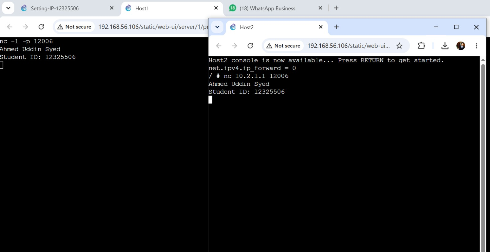

# Week 03 – Task 1: Simple Application Communication with Netcat

## Student information

- **Student:** Ahmed Uddin Syed
- **Student ID:** 12325506
- **Unit code:** COIT20261
- **Tutor:** Mr Hossain
- **Campus:** Sydney
- **Date completed:** 29 August 2026

## Aim

The aim of this activity is to use Netcat to establish a simple
client-server connection between two Linux hosts and exchange text
messages over TCP.

## Network information

This activity uses the `Setting-IP-12325506` GNS3 project created in
Week 2.

| Role | Device | IPv4 address | TCP port |
|---|---|---|---|
| Server | Host1 | 10.2.1.1/24 | 12006 |
| Client | Host2 | 10.2.1.2/24 | 12006 |

Port `12006` was selected because the activity requires a port other than
`12345`.

## Commands used

### Netcat server on Host1

```bash
nc -l -p 12006
```

### Netcat client on Host2

```bash
nc 10.2.1.1 12006
```

## Messages exchanged

The following messages were exchanged after the connection was
established:

- Client to server: `Ahmed Uddin Syed`
- Server to client: `Student ID: 12325506`

## Results and evidence

### Netcat client-server communication



The screenshot shows the Netcat server and client commands and the
messages exchanged between Host1 and Host2.

## Observations

The Netcat server listened for incoming TCP connections on port `12006`.
The Netcat client connected using the server's IPv4 address and TCP port.
Text entered in one console was transmitted across the network and
displayed in the other console.

## Problems and solutions

This section will be completed after the practical activity.

## What I learned

This section will be completed after the practical activity.

## Submitted files

- `screenshots/Netcat-Basics-12325506-client-server.jpeg`
