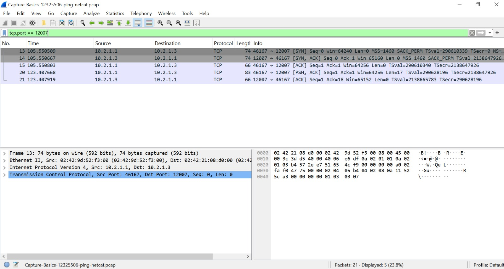

# Week 03 – Task 2: Capturing Packets

## Student information

- **Student:** Ahmed Uddin Syed
- **Student ID:** 12325506
- **Unit code:** COIT20261
- **Tutor:** Mr Hossain
- **Campus:** Sydney
- **Date completed:** 29 August 2026

## Aim

The aim of this activity is to capture network packets on a GNS3 link,
generate ICMP and TCP traffic and transfer the resulting packet capture
file to the host computer.

## Network information

This activity uses the `Setting-IP-12325506` project.

| Device | IPv4 address | Activity |
|---|---|---|
| Host1 | 10.2.1.1/24 | Ping and Netcat client |
| Host2 | 10.2.1.2/24 | Ping destination |
| Host3 | 10.2.1.3/24 | Netcat server |

The packet capture was taken on the link between Host1 and the Ethernet
switch.

## Traffic generated

### ICMP traffic

Host1 sent three ping requests to Host2:

```bash
ping -c 3 10.2.1.2
```

### TCP/Netcat traffic

Host3 listened on TCP port `12007`:

```bash
nc -l -p 12007
```

Host1 connected to Host3:

```bash
nc 10.2.1.3 12007
```

The following message was sent from Host1 to Host3:

```text
Ahmed Uddin Syed
```

## Packet-capture procedure

1. Started a packet capture on the Host1-to-switch link.
2. Selected Ethernet as the link type.
3. Generated three ICMP echo requests and replies.
4. Established a Netcat TCP connection.
5. Sent my name from Host1 to Host3.
6. Stopped the packet capture.
7. Transferred the PCAP file from the GNS3 server to the host computer.
8. Opened the file in Wireshark to confirm that packets were captured.

## Results and evidence

### Captured packets in Wireshark



The packet capture contains ICMP traffic generated by ping and TCP
traffic generated by the Netcat connection.

## Observations

The ping test generated ICMP echo-request and echo-reply packets. Netcat
generated TCP connection and application-data packets. Capturing the link
connected to Host1 allowed both types of traffic to be recorded.

## Problems and solutions

This section will be completed after the practical activity.

## What I learned

This section will be completed after the practical activity.

## Submitted files

- `Capture-Basics-12325506-ping-netcat.pcap`
- `screenshots/Capture-Basics-12325506-wireshark.jpeg`
