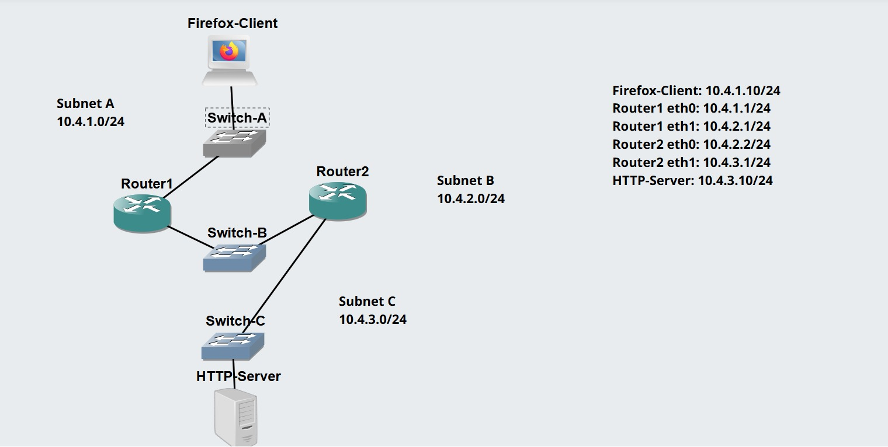
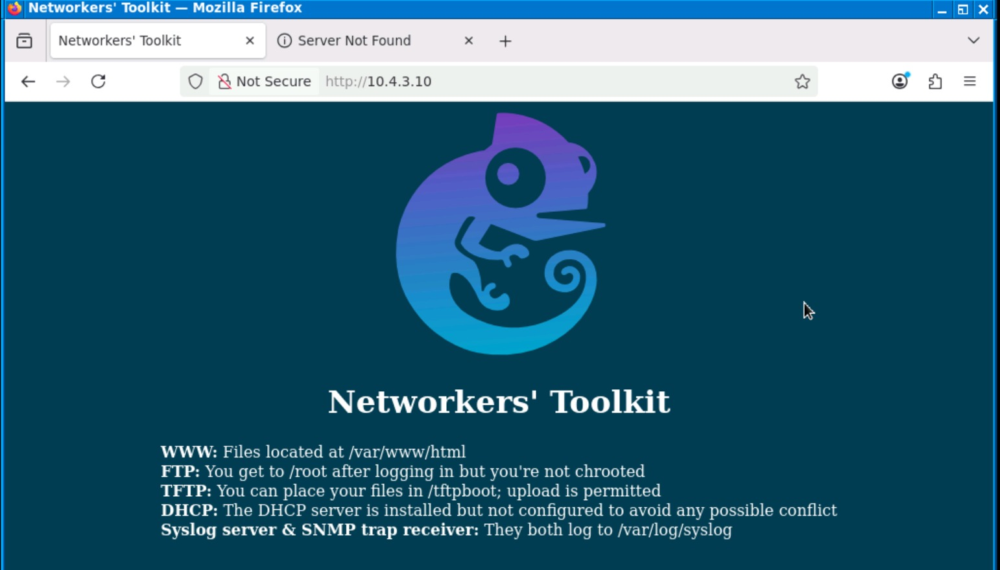
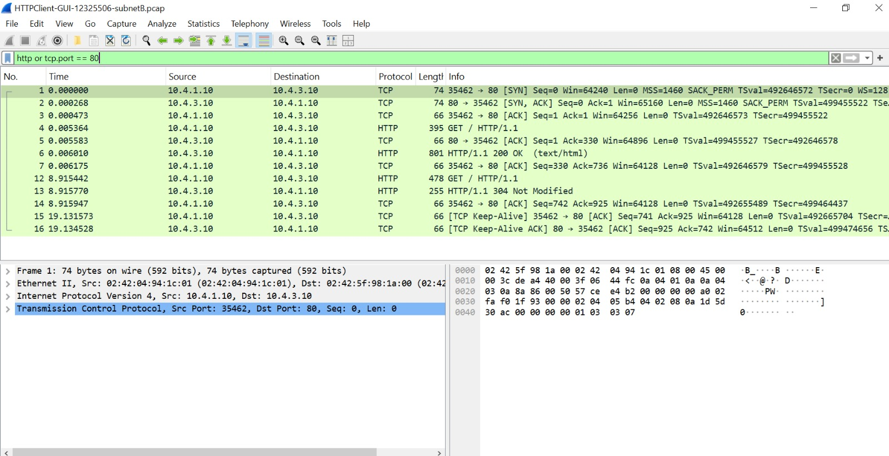

# Week 04 – Task 1: HTTP Client with GUI

## Student information

- **Student:** Ahmed Uddin Syed
- **Student ID:** 12325506
- **Unit code:** COIT20261
- **Tutor:** Mr Hossain
- **Campus:** Sydney
- **Date completed:** 29 August 2026

## Aim

The aim of this activity is to use a graphical web browser as an HTTP
client, access a web server across a routed network and capture the HTTP
traffic travelling between two routers.

## Project information

- **Project name:** HTTPClient-GUI-12325506
- **Client:** Firefox Host
- **Server:** Linux Server
- **Routers:** Two Linux Routers
- **Subnets:** Three IPv4 subnets

## IP addressing plan

| Subnet | Device/interface | IPv4 address | Gateway |
|---|---|---|---|
| Subnet A | Firefox Host | 10.4.1.10/24 | 10.4.1.1 |
| Subnet A | Router1 eth0 | 10.4.1.1/24 | Not required |
| Subnet B | Router1 eth1 | 10.4.2.1/24 | Not required |
| Subnet B | Router2 eth0 | 10.4.2.2/24 | Not required |
| Subnet C | Router2 eth1 | 10.4.3.1/24 | Not required |
| Subnet C | Linux Server | 10.4.3.10/24 | 10.4.3.1 |

## Network design

Subnet A contains a Firefox Host and switch connected to Router1. Subnet
B contains a switch connecting Router1 and Router2. Subnet C contains a
Linux Server and switch connected to Router2.

Router1 and Router2 forward traffic between the three subnets.

## Routing configuration

Router1 uses a route to Subnet C through Router2:

```bash
ip route add 10.4.3.0/24 via 10.4.2.2
```

Router2 uses a route to Subnet A through Router1:

```bash
ip route add 10.4.1.0/24 via 10.4.2.1
```

IP forwarding is enabled on both routers:

```bash
sysctl net.ipv4.ip_forward=1
```

## Procedure

1. Created a network containing three subnets.
2. Configured static IPv4 addresses and default gateways.
3. Enabled IP forwarding on both routers.
4. Added routes between the remote subnets.
5. Tested end-to-end connectivity.
6. Started a packet capture on a link in Subnet B.
7. Opened the Firefox Host through the VNC client.
8. Accessed the Linux Server using its IPv4 address.
9. Stopped and transferred the packet capture.

## Results and evidence

### Network topology



### Website displayed in Firefox



The Firefox Host successfully accessed the website hosted by the Linux
Server across the routed network.

### Captured HTTP traffic



## Problems and solutions

This section will be completed after the practical activity.

## What I learned

This section will be completed after the practical activity.

## Submitted files

- `HTTPClient-GUI-12325506.gns3project.zip`
- `HTTPClient-GUI-12325506-subnetB.pcap`
- `screenshots/HTTPClient-GUI-12325506-network.jpeg`
- `screenshots/HTTPClient-GUI-12325506-firefox.jpeg`
- `screenshots/HTTPClient-GUI-12325506-wireshark.jpeg`
