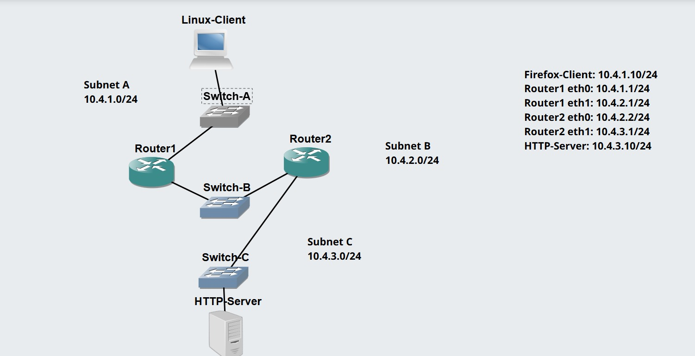
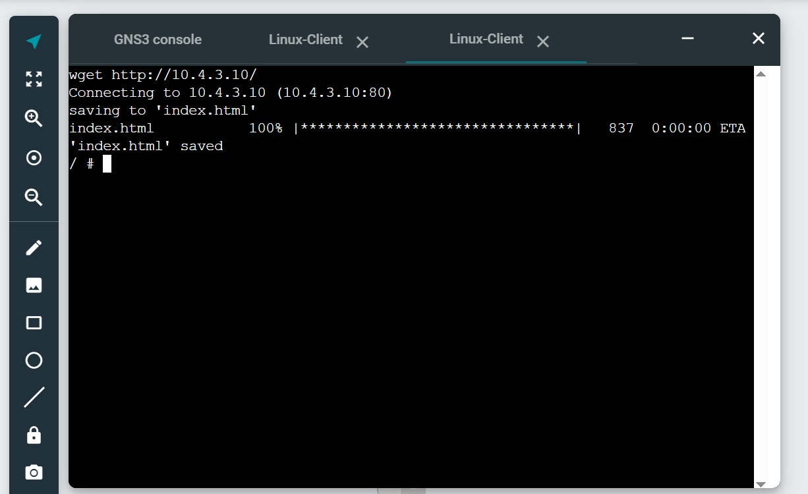
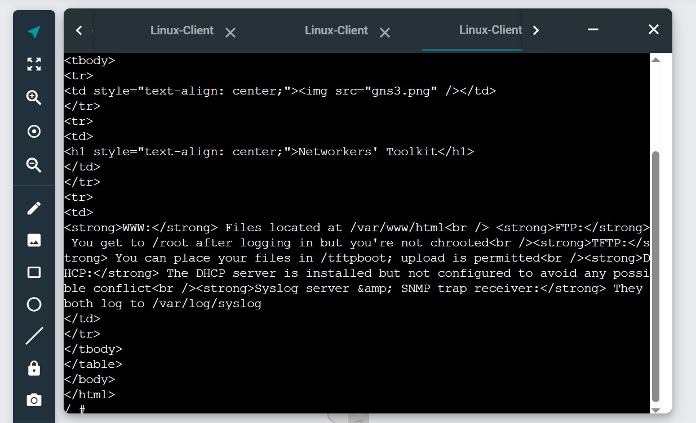
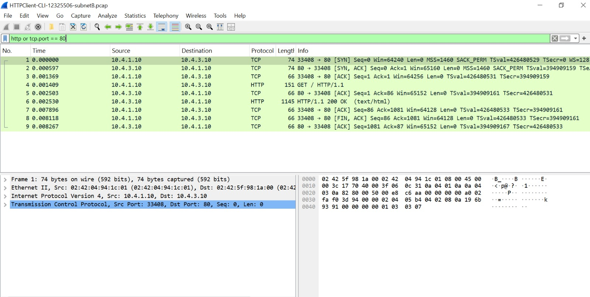

# Week 04 – Task 2: HTTP Client with Command Line Interface

## Student information

- **Student:** Ahmed Uddin Syed
- **Student ID:** 12325506
- **Unit code:** COIT20261
- **Tutor:** Mr Hossain
- **Campus:** Sydney
- **Date completed:** 29 August 2026

## Aim

The aim of this activity is to access a web server using command-line
HTTP clients and capture the HTTP traffic generated by `wget`.

## Project information

- **Project name:** HTTPClient-CLI-12325506
- **Client:** Linux Host
- **Server:** Linux Server
- **HTTP clients:** wget and curl
- **Server address:** 10.4.3.10

## Procedure

1. Duplicated the Week 4 GUI project.
2. Replaced the Firefox Host with a Linux Host.
3. Assigned the replacement host the same IPv4 address and gateway.
4. Verified end-to-end connectivity.
5. Captured traffic on a link in Subnet B.
6. Used `wget` to access the web server.
7. Stopped the packet capture.
8. Used `curl` to access the same web server.

## Commands used

```bash
ping -c 3 10.4.3.10
wget http://10.4.3.10/
curl http://10.4.3.10/
```

## Results and evidence

### Network topology



### wget result



### curl result



### Captured traffic



## Observations

`wget` downloaded the web page and saved it as a file. `curl` displayed
the received HTML directly in the console. Both programs acted as HTTP
clients without requiring a graphical browser.

## Problems and solutions

The graphical Firefox Host from the previous project was replaced with a
Linux Host configured with the same IPv4 address and gateway. I verified
the replacement configuration using `ip address show`, `ip route show`
and ping before running the HTTP tests.

## What I learned

I learned that web servers can be accessed without a graphical browser.
`wget` downloaded the web page and saved it locally, while `curl`
displayed the HTTP response content directly in the console. Command-line
HTTP clients require fewer resources and are useful for testing and
automation.

## Submitted files

- `HTTPClient-CLI-12325506.gns3project.zip`
- `HTTPClient-CLI-12325506-subnetB.pcap`
- `screenshots/HTTPClient-CLI-12325506-network.jpeg`
- `screenshots/HTTPClient-CLI-12325506-wget.jpeg`
- `screenshots/HTTPClient-CLI-12325506-curl.jpeg`
- `screenshots/HTTPClient-CLI-12325506-wireshark.jpeg`
