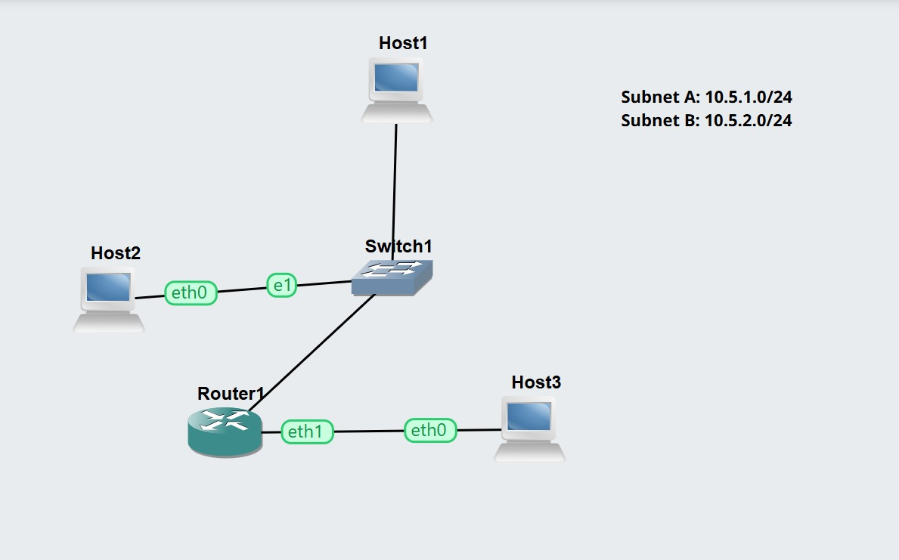
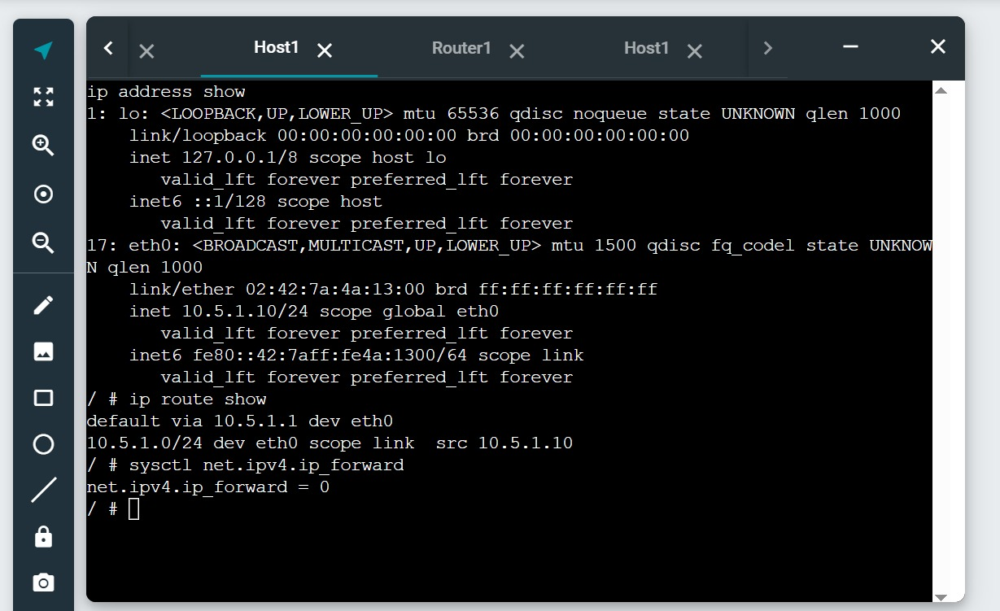
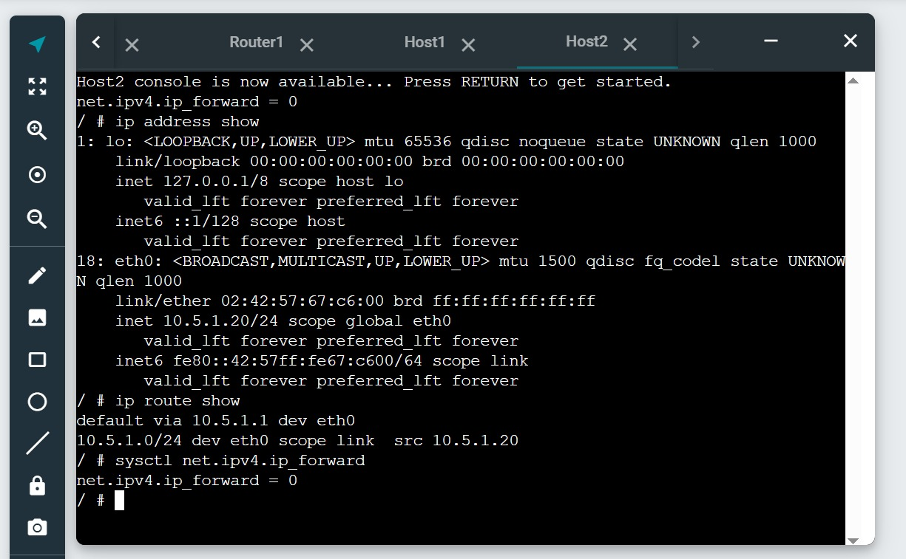
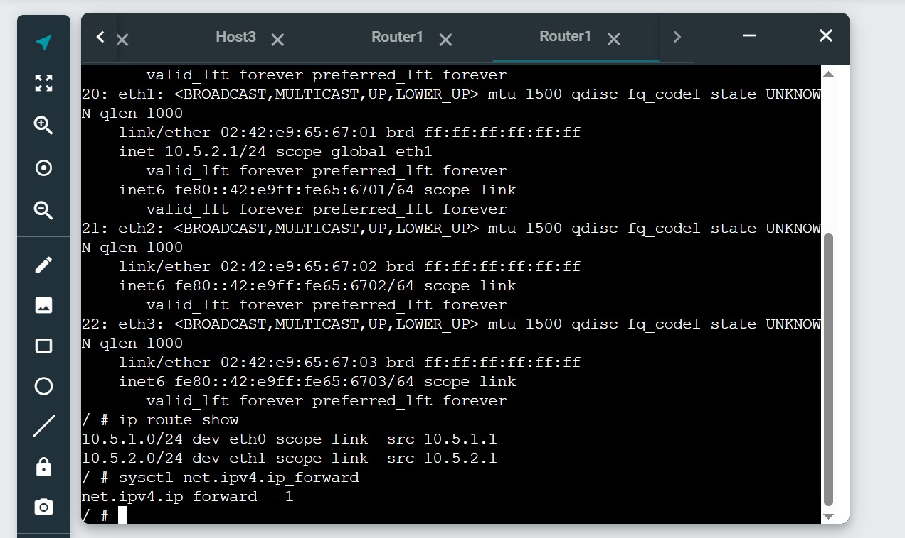
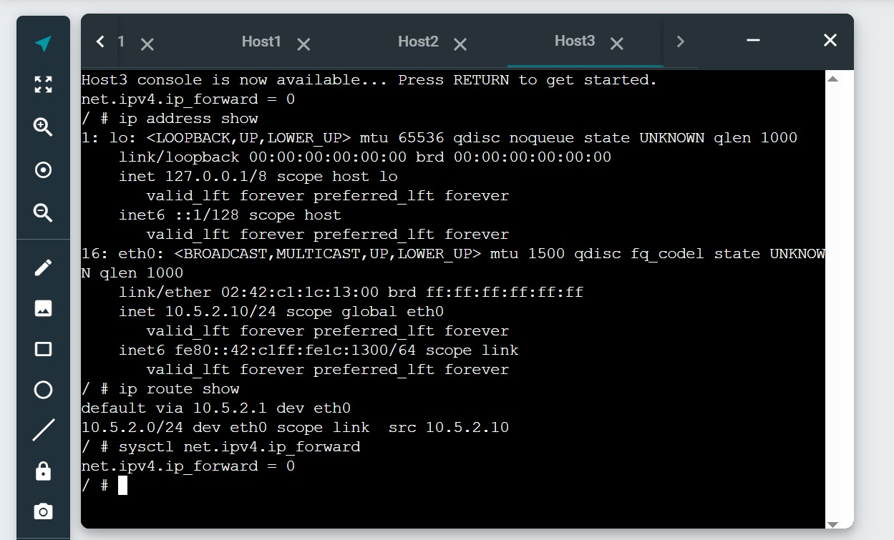
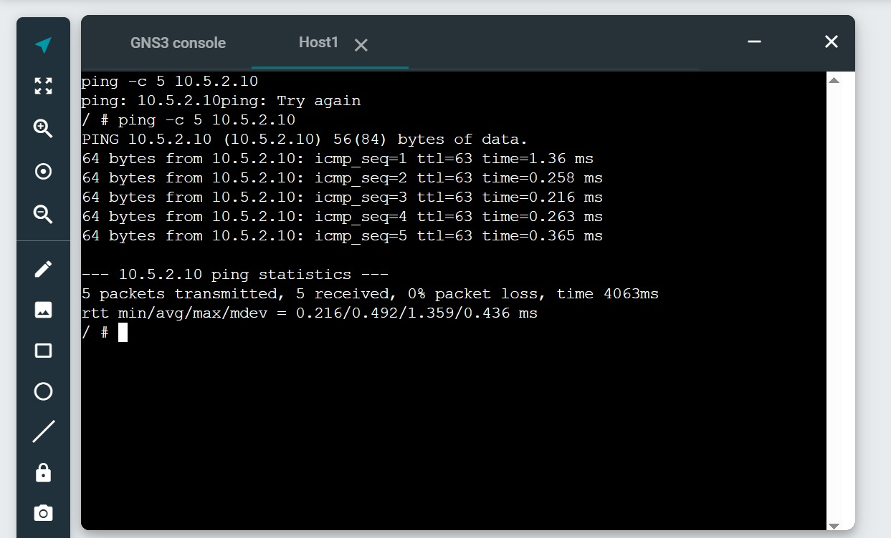

# Week 05 – Task 1: View Routing Tables

## Student information

- **Student:** Ahmed Uddin Syed
- **Student ID:** 12325506
- **Unit code:** COIT20261
- **Tutor:** Mr Hossain
- **Campus:** Sydney
- **Date completed:** 29 August 2026

## Aim

The aim of this activity is to examine Linux routing tables, configure
default gateways and enable IP forwarding on a router so hosts on
different subnets can communicate.

## Project information

- **Project name:** View-Routes-12325506
- **Subnets:** Two
- **Hosts:** Three Linux Hosts
- **Router:** One Linux Router
- **Switch:** One Ethernet switch

## IP addressing plan

| Device/interface | IPv4 address | Default gateway | Forwarding |
|---|---|---|---|
| Host1 eth0 | 10.5.1.10/24 | 10.5.1.1 | Disabled |
| Host2 eth0 | 10.5.1.20/24 | 10.5.1.1 | Disabled |
| Router1 eth0 | 10.5.1.1/24 | None | Enabled |
| Router1 eth1 | 10.5.2.1/24 | None | Enabled |
| Host3 eth0 | 10.5.2.10/24 | 10.5.2.1 | Disabled |

## Network design

Host1 and Host2 connect to an Ethernet switch in Subnet A. Router1 also
connects to that switch through `eth0`. Host3 connects directly to
Router1's `eth1` interface in Subnet B.

## Commands used

```bash
ip address show
ip route show
sysctl net.ipv4.ip_forward
ping -c 5 10.5.2.10
```

## Routing-table summary

| Device | Destination | Next hop or interface |
|---|---|---|
| Host1 | 10.5.1.0/24 | Directly connected through eth0 |
| Host1 | Default | 10.5.1.1 |
| Host2 | 10.5.1.0/24 | Directly connected through eth0 |
| Host2 | Default | 10.5.1.1 |
| Router1 | 10.5.1.0/24 | Directly connected through eth0 |
| Router1 | 10.5.2.0/24 | Directly connected through eth1 |
| Host3 | 10.5.2.0/24 | Directly connected through eth0 |
| Host3 | Default | 10.5.2.1 |

## Results and evidence

### Network topology



### Host1 routing information



### Host2 routing information



### Router routing information



### Host3 routing information



### Successful inter-subnet ping



## Problems and solutions

Hosts on different subnets initially required correct default-gateway
settings before they could communicate. I verified that Host1 and Host2
used `10.5.1.1`, Host3 used `10.5.2.1` and Router1 had forwarding
enabled. After confirming the routing tables, inter-subnet ping completed
successfully.

## What I learned

I learned that hosts send traffic for remote networks to a default
gateway, while a router uses its routing table to select the outgoing
interface. Router1 had both subnets as directly connected routes and
required IP forwarding to transfer packets between them. Hosts had
forwarding disabled because they were end devices rather than routers.

## Submitted files

- `View-Routes-12325506.gns3project.zip`
- `screenshots/View-Routes-12325506-network.jpeg`
- `screenshots/View-Routes-12325506-host1-routes.jpeg`
- `screenshots/View-Routes-12325506-host2-routes.jpeg`
- `screenshots/View-Routes-12325506-router-routes.jpeg`
- `screenshots/View-Routes-12325506-host3-routes.jpeg`
- `screenshots/View-Routes-12325506-ping.jpeg`
