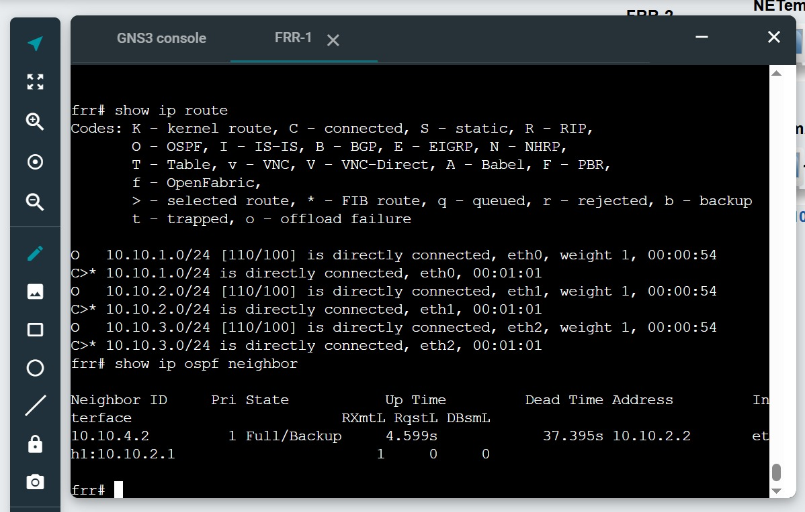
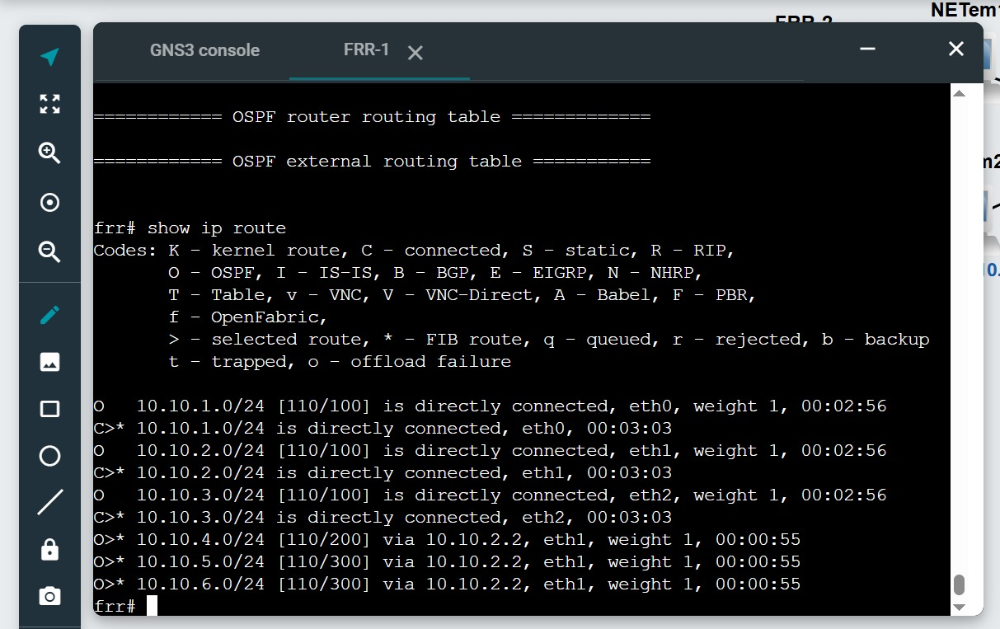
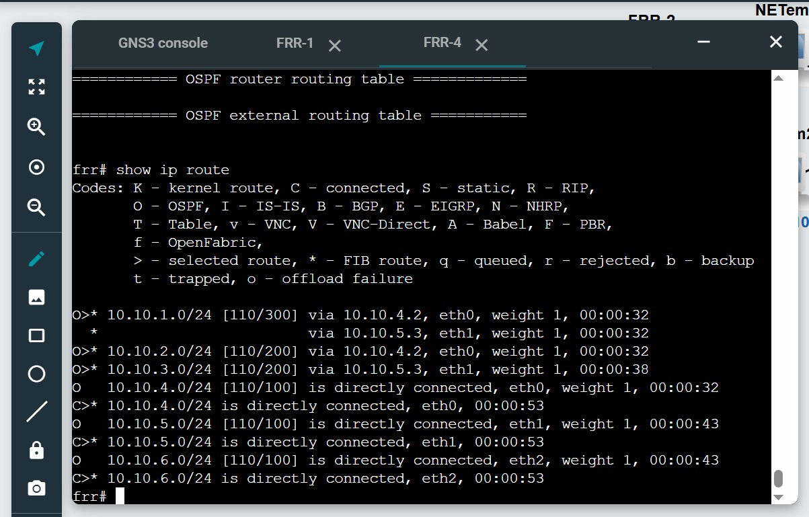
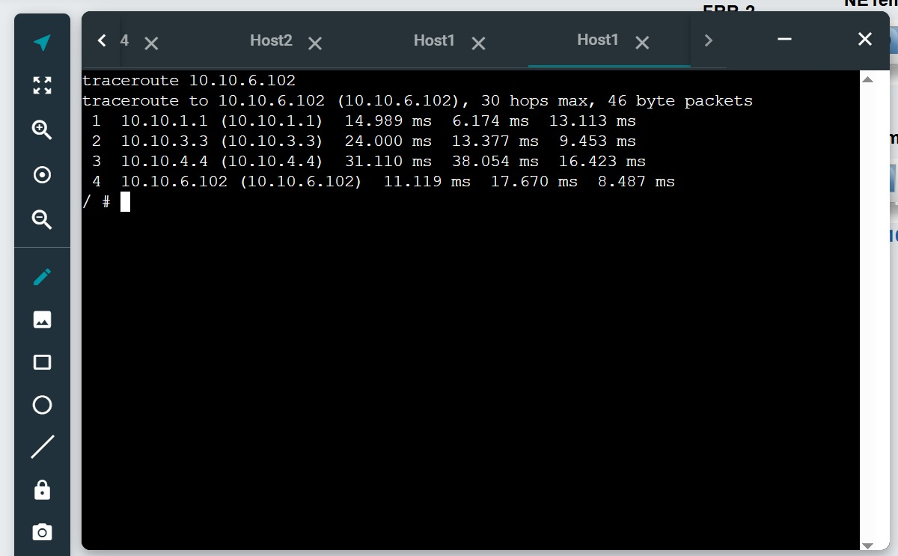
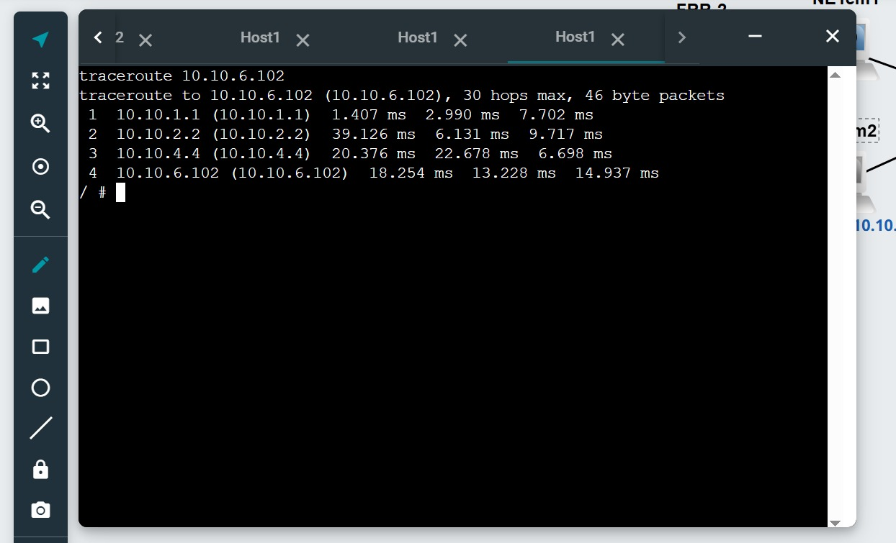
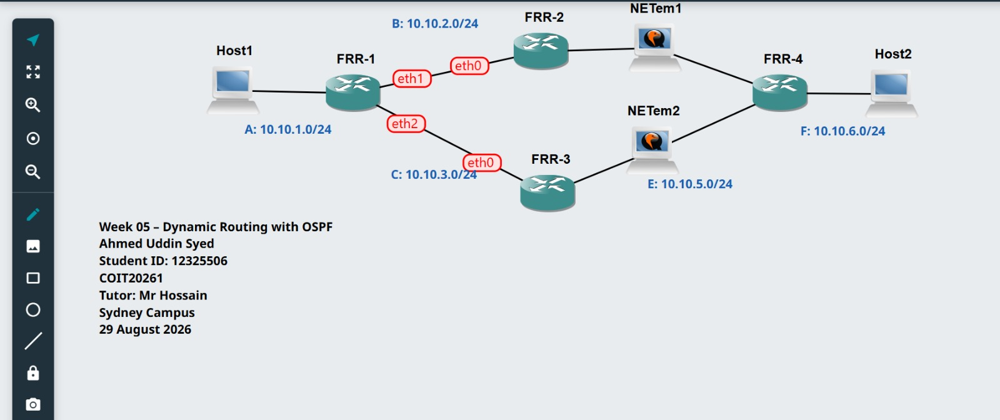

# Week 05 – Task 2: Dynamic Routing with OSPF

## Student information

- **Student:** Ahmed Uddin Syed
- **Student ID:** 12325506
- **Unit code:** COIT20261
- **Tutor:** Mr Hossain
- **Campus:** Sydney
- **Date completed:** 29 August 2026

## Aim

The aim of this activity is to examine OSPF neighbour relationships and
routing tables and observe how OSPF selects an alternative path after a
network link becomes unavailable.

## Project information

- **Template:** OSPF-Basics-Template
- **Project name:** OSPF-Basics-12325506
- **Routing protocol:** OSPF
- **Routers:** FRR1, FRR2, FRR3 and FRR4
- **End devices:** Host1 and Host2

## Commands used

### FRR routing commands

```text
show ip ospf neighbor
show ip ospf route
show ip route
```

### Host path command

```bash
traceroute DESTINATION_IP
```

## OSPF neighbour information



FRR1 discovered its directly connected OSPF neighbour routers and formed
adjacencies with them.

## Routing-table evidence

### FRR1 routing information



### FRR4 routing information



## Router summary

| Router | Destination | Next node | Interface/notes |
|---|---|---|---|
| FRR1 | 10.10.6.0/24 | 10.10.2.2 | eth1, OSPF metric 300 |
| FRR2 | 10.10.6.0/24 | 10.10.4.4 | eth1, OSPF metric 200 |
| FRR3 | 10.10.6.0/24 | 10.10.3.1 | eth0, OSPF metric 400 after NETem2 stopped |
| FRR4 | 10.10.1.0/24 | 10.10.4.2 and 10.10.5.3 | Equal-cost OSPF paths through eth0 and eth1 |

## Path before link failure



The initial traceroute shows the path selected by OSPF before the network
change.

## Path after link failure



After stopping the NETem node on the active path, OSPF recalculated the
routes and traffic used the remaining alternative path.

## Network topology



## Problems and solutions

This section will be completed after the practical activity.

## What I learned

This section will be completed after the practical activity.

## Submitted files

- `OSPF-Basics-12325506.gns3project.zip`
- `screenshots/OSPF-Basics-12325506-network.jpeg`
- `screenshots/OSPF-Basics-12325506-frr1-neighbors.jpeg`
- `screenshots/OSPF-Basics-12325506-frr1-routes.jpeg`
- `screenshots/OSPF-Basics-12325506-frr4-routes.jpeg`
- `screenshots/OSPF-Basics-12325506-traceroute-before.jpeg`
- `screenshots/OSPF-Basics-12325506-traceroute-after.jpeg`
